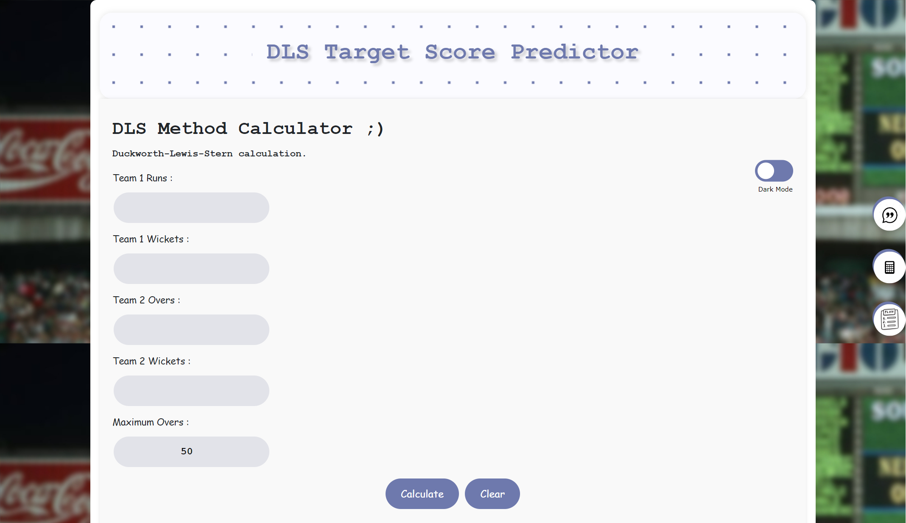
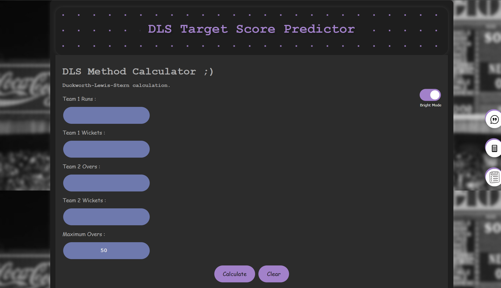
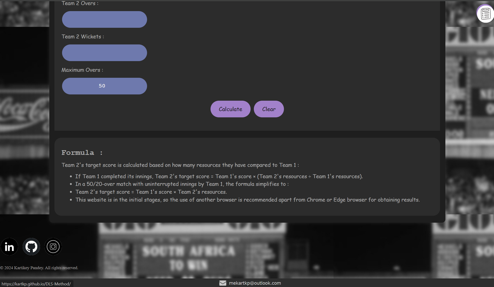
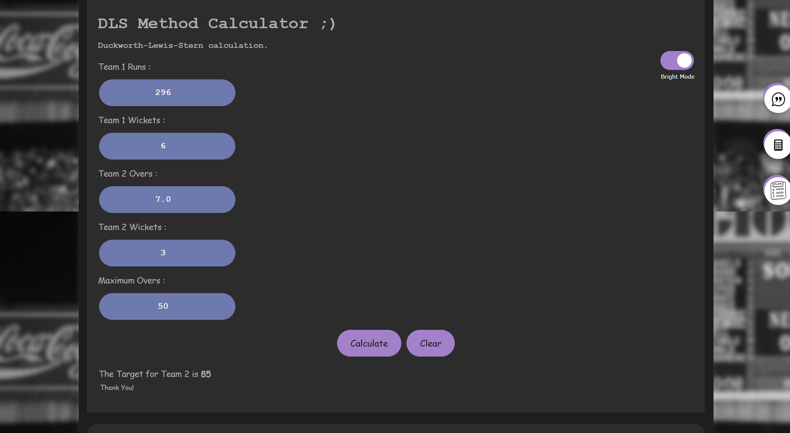

# Duckworth-Lewis-Stern (DLS) Method Calculator

Welcome to the Duckworth-Lewis-Stern (DLS) Method Calculator! This online sports calculator is designed to help you determine target scores in rain-interrupted fifty and twenty-twenty overs cricket matches.

## Features

- **Interactive Interface**: A user-friendly interface to easily input match details and get quick results.
- **Responsive Design**: Compatible with various devices including desktops, tablets, and smartphones.
- **Visual Appeal**: Cool and visually appealing design elements to enhance user experience.

## How to Use

1. **Input Match Details**: Enter the match details including team scores, overs, and wickets.
2. **Calculate**: Click on the "Calculate" button to get the adjusted target score based on the DLS method.
3. **Results**: View the results instantly on the screen.

## Demo

You can try out the calculator [here](https://kartkp.github.io/DLS-Method/).

## Previews

### Screenshot

## Development

### Prerequisites

- Web Browser (Chrome, Firefox, Safari, etc.)
- Result will only appear in Phoenix Browser(Because of SSR not functional on GitHub).
